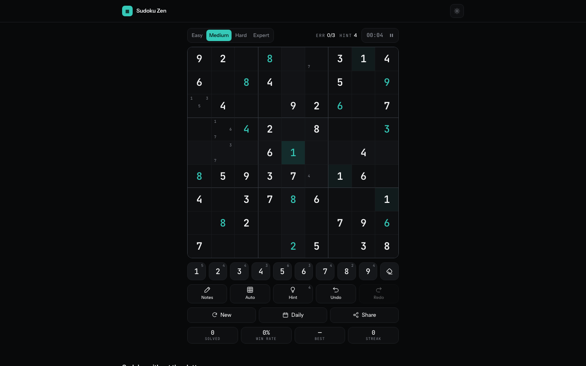
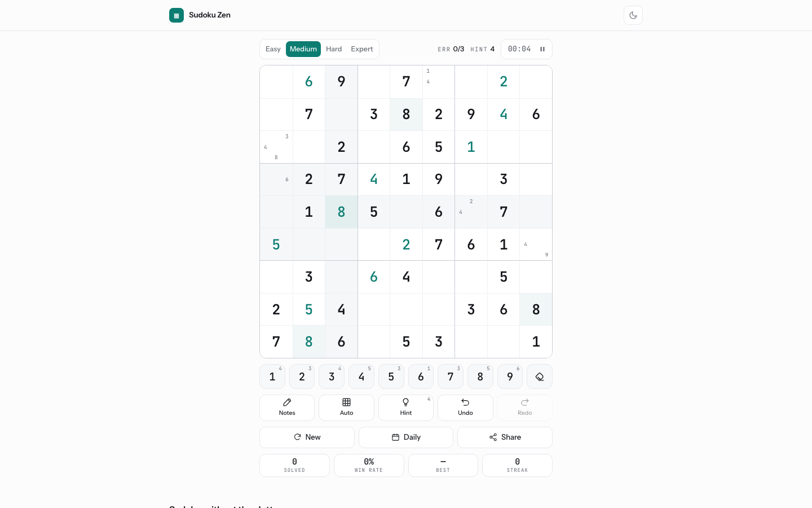
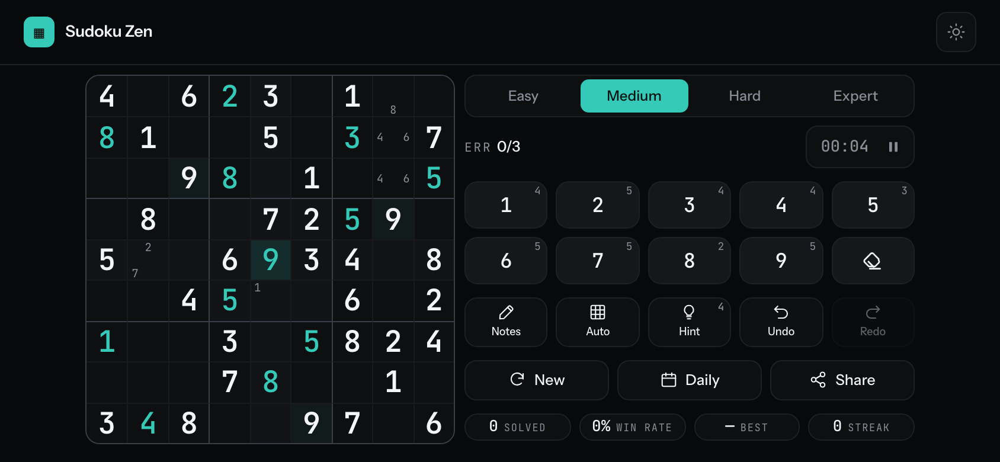
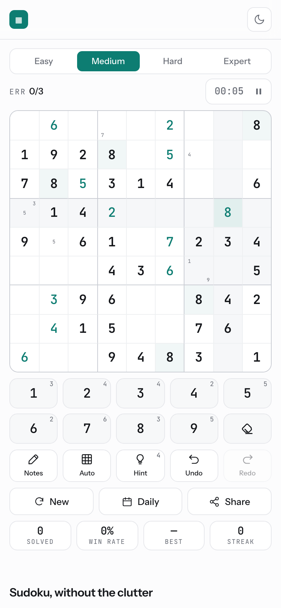

# Sudoku Zen

A minimalist Sudoku game that runs entirely in your browser. No sign-up, no account,
no ads, no tracking, no server. Puzzles are generated on your device, and your
progress lives in your own browser.

**Live site:** https://jgohil07.github.io/SudokuZen/

<p align="center">
  
</p>

| Light theme | Phone, landscape |
| --- | --- |
|  |  |

<p align="center">
  
</p>

## What's in it

**Play** — Four difficulties (Easy · Medium · Hard · Expert) · pencil marks · automatic
candidate marks · live conflict highlighting · a mistake counter · a hint budget that
explains its reasoning · unlimited undo and redo.

**Come back to it** — Your puzzle, notes, timer and statistics are saved as you play.
Reopen the site and it asks whether to resume or start fresh, rather than deciding for you.

**Share it** — A daily puzzle derived from the date, so everyone gets the same grid,
plus `#p=` permalinks for any specific puzzle.

**Anywhere** — Phones, tablets and desktops, portrait and landscape. Light and dark themes
that follow your system by default. Full keyboard control. Works offline after the first visit.

## Why it's different

Most Sudoku generators poke random holes in a completed grid and hope for the best. That
produces puzzles with **more than one solution**, and when the game grades your board against
the single solution it happens to have stored, a perfectly valid answer gets marked wrong.

Sudoku Zen removes one clue at a time and re-solves the grid after every removal, keeping the
removal only while exactly one solution remains. A puzzle is not served until that holds. Winning
is then decided by the board itself — every cell filled, no digit repeated in any row, column or
box — not by comparison against a stored answer key.

## Technical notes

- **No build step.** Plain HTML, CSS and ES modules. What is in the repository is what the
  browser runs; a deploy is a `git push`.
- **No dependencies.** No framework, no bundler, no npm. The only external request is Google Fonts,
  loaded asynchronously with a system-font fallback.
- **Three modules.** `sudoku-core.js` is pure puzzle logic with no DOM access; `sudoku-state.js`
  owns game state, undo/redo and persistence; `sudoku-ui.js` is the only file that touches the DOM.
- **Seeded generation.** A mulberry32 PRNG makes every puzzle reproducible from its seed, which is
  what makes daily puzzles and share links work.
- **Fast enough to be invisible.** Uniqueness checking uses a minimum-remaining-values solver. In
  the test suite, generating a puzzle (uniqueness checks included) averages under 2 ms at every
  difficulty; the slowest Expert puzzle took about 13 ms on a recent laptop.
- **Storage is one versioned, whitelisted blob**, written on a debounce rather than on every tick,
  and every read and write tolerates storage being unavailable.
- **Offline** via a service worker caching the app shell — network-first for navigation so a deploy
  is picked up, cache-first (refreshed in the background) for everything else.

## Running locally

```
python3 -m http.server 8000
```

Then open <http://localhost:8000>. Opening `index.html` as a `file://` URL will not work, because
ES modules and the service worker both require a real origin.

## Tests

Open <http://localhost:8000/tests.html>, or the [live copy](https://jgohil07.github.io/SudokuZen/tests.html).
The suite runs in the browser with no tooling and checks that:

- every generated puzzle has exactly one solution and a clue count inside its difficulty's band
- generation is deterministic, which daily puzzles and share links depend on
- conflict detection, hints, candidate marks and digit counts behave
- browser storage can round-trip a saved-game blob

It generates 25 puzzles per difficulty by default (`?n=100` for a longer run) and reports how long
generation took.

## Project structure

```
index.html              the page, including the game's markup
sudoku.css              all styles, light and dark
sudoku-core.js          pure puzzle logic: generator, solver, hints, conflicts (no DOM)
sudoku-state.js         game state, undo/redo, statistics and persistence
sudoku-ui.js            rendering, input and dialogs — the only module that touches the DOM
sw.js                   offline app shell
tests.html, tests.js    browser test suite
manifest.webmanifest    install metadata; icons alongside
sitemap.xml, robots.txt search engine hints
docs/screenshots/       images used in this README
```

## Keyboard

<kbd>1</kbd>–<kbd>9</kbd> place · <kbd>Shift</kbd>+<kbd>1</kbd>–<kbd>9</kbd> pencil mark ·
<kbd>0</kbd>/<kbd>Backspace</kbd> erase · arrows or <kbd>WASD</kbd> move · <kbd>N</kbd> notes ·
<kbd>M</kbd> auto marks · <kbd>H</kbd> hint · <kbd>Ctrl</kbd>+<kbd>Z</kbd> undo ·
<kbd>Ctrl</kbd>+<kbd>Shift</kbd>+<kbd>Z</kbd> redo · <kbd>Space</kbd> pause · <kbd>Esc</kbd> deselect.

## Disclaimer

Your progress is stored in your browser's local storage. Clearing site data, or playing in a
private window, will clear it. Nothing is backed up anywhere, because nothing is uploaded anywhere.

---

From indie dev Jay
